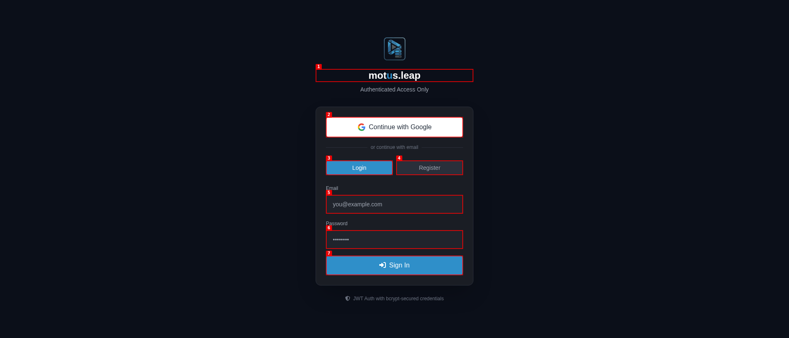

# motus.leap


<p align="center">
  
</p>

<h2 align="center">Automated YouTube Playlist Orchestrator</h2>

<p align="center">
  <a href="https://tubemanager.onrender.com">🌐 Live Demo</a> &nbsp;|&nbsp;
  <a href="https://github.com/dave-patrick/motus.leap/issues">Report Bug</a> &nbsp;|&nbsp;
  <a href="https://github.com/dave-patrick/motus.leap/discussions">Request Feature</a>
</p>

---

## 👁️ Screenshots

<p align="center">
  
</p>

<p align="center">
  <em>Modern dark-themed authentication with Google OAuth and JWT-backed sessions.</em>
</p>

---

## ✨ Features

### Core
- 🎬 **YouTube Data API v3** — Real-time playlist & subscription management  
- 🔗 **Channel-to-Playlist Mappings** — Auto-route videos by channel  
- 🤖 **AI Classification** — LLM-powered video categorization  
- 📊 **Full Cluster Scan** — Deep YouTube account analysis  

### Advanced
- 📦 **Bulk Operations** — Move, delete, and tag videos in batches  
- 📤 **JSON/CSV Import** — Migrate playlists & subscriptions  
- 👥 **Multi-User RBAC** — Admin / User / Viewer roles  
- 🔒 **Enterprise Security** — CSP, rate limiting, XSS sanitization, bcrypt  
- ⚡ **Performance** — LRU cache, HTTP pooling, async I/O  

### UX
- ⌨️ **Keyboard Shortcuts** — `G+D`, `F`, `?`  
- 🎨 **Dark Theme** — Tailwind CSS bento-grid UI  
- 📱 **Responsive** — Desktop, tablet, and mobile  
- 🔔 **Toasts** — Real-time success/error feedback  

---

## 🏗️ Architecture

```
tube-manager/
├── app.py                    # FastAPI entry point
├── api/
│   ├── auth.py              # JWT + Google/YouTube OAuth
│   ├── bulk_operations.py   # Batch endpoints
│   ├── mappings.py          # Channel mapping CRUD
│   └── websocket.py         # Live terminal
├── services/
│   ├── youtube_service.py   # YouTube API client
│   └── ai_service.py        # AI classifier
├── core/
│   ├── lru_cache.py         # Async LRU cache
│   ├── http_client.py       # Connection pooling
│   └── security.py          # CSP + rate limiting
├── web/                     # Static HTML + JS
└── tests/                   # pytest (unit, integration, security, load)
```

---

## 🚀 Quick Start

### Prerequisites
- Python 3.11+
- YouTube Data API v3 credentials (OAuth client ID/secret)

### Install

```bash
git clone https://github.com/dave-patrick/motus.leap.git
cd motus.leap/tube-manager
python -m venv .venv
source .venv/bin/activate  # Windows: .venv\Scripts\activate
pip install -r requirements.txt
```

### Configure

```bash
cp env.example .env
# Required:
# TUBE_MANAGER_SECRET_KEY=*** GOOGLE_OAUTH_CLIENT_ID=*** GOOGLE_OAUTH_CLIENT_SECRET=*** Run

```bash
uvicorn app:app --host 0.0.0.0 --port 8000 --reload
```

Then open `http://localhost:8000`.

---

## ☁️ Deploy to Render

1. Fork this repo  
2. Create a **Web Service** on [Render](https://render.com)  
   - Root Directory: `tube-manager`  
   - Build: `pip install --no-cache-dir -r requirements.txt`  
   - Start: `uvicorn app:app --host 0.0.0.0 --port $PORT`  
3. Add environment variables in Render Dashboard  
4. Attach a persistent **Disk** mounted at `/app/data` (1 GB+)  

Render auto-deploys on every push to `main` via GitHub Actions.

---

## 📊 Status

| Item | State |
|------|-------|
| Live Demo | 🟢 https://tubemanager.onrender.com |
| Tests | 83+ (unit, integration, security, load) |
| Maintenance | 🟢 Active development |
| New Features | 🟢 Ongoing |

---

## 🤝 Contributing

Contributions are welcome!

1. Fork the repo  
2. Create a branch (`git checkout -b feature/amazing-feature`)  
3. Commit and push  
4. Open a PR describing the change  

For bugs, please open an issue first.

---

## 📄 License

MIT — see [LICENSE](LICENSE)

---

## 🙏 Acknowledgments

- **YouTube Data API v3**  
- **FastAPI** / **Uvicorn**  
- **Render** for hosting  
- **Tailwind CSS** / **FontAwesome**  

---

<p align="center">
  <sub>Built with ❤️ by Dave Patrick</sub>
</p>
